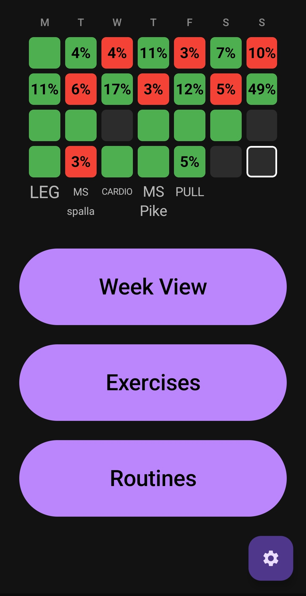
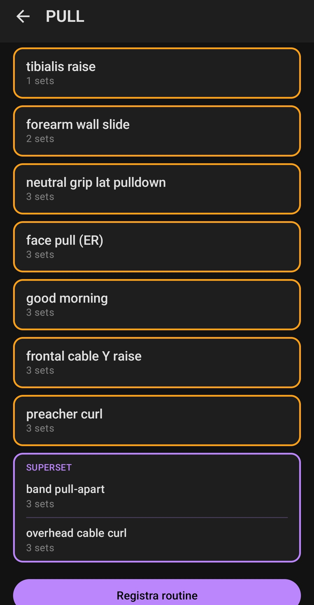
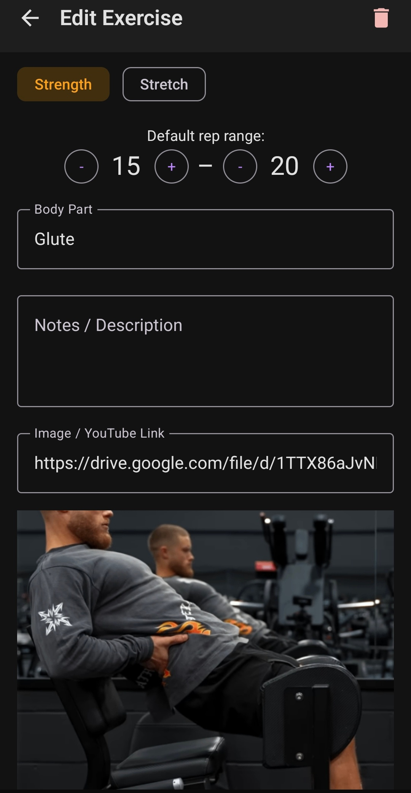

# MyGymApp

A personal Android gym tracking app built with Kotlin and Jetpack Compose. Inspired by [Obsidian](https://obsidian.md/), all data is stored as plain `.md` files with YAML frontmatter — no database, no cloud, full ownership of your data. Optional Polar H10 integration adds live heart rate, ECG, HRV readiness and VO2max. Optional integrations also cover a VitaFit BLE scale (weight/BMI/body-fat) and Health Connect step counts. All of it can optionally sync to a self-hosted server over Tailscale — see [SYNC.md](docs/SYNC.md); nothing leaves the device otherwise.

## Screenshots

<p align="center">
  
  &nbsp;&nbsp;
  
  &nbsp;&nbsp;
  
</p>

<p align="center">
  <em>Main screen (gitgraph) &nbsp;|&nbsp; Active routine &nbsp;|&nbsp; Exercise editor</em>
</p>

## Features

- **Gitgraph dashboard** — 4×7 grid of the last 28 days. Each cell shows a workout's tonnage change vs. the previous session for that routine (green = improved, red = regressed). Routine names appear below the current week.
- **Week view** — routines assigned to each day of the week.
- **Exercise library** — exercises grouped by body part with orange (strength) / blue (stretch) color coding. Attach an image or YouTube link to any exercise.
- **Routine builder** — sets, rep ranges, supersets via a chain-link button, drag-and-drop reorder.
- **Active workout** — tap an exercise to log sets. Strength exercises use a vertical scroll picker (no keyboard). Stretch exercises use a stopwatch with a status-bar notification.
- **Supersets** — interleaved sets for two paired exercises in a single screen, pre-populated from your previous session.
- **Progress charts** — per-bodypart tonnage line chart after completing a routine. Compares only exercises present in both sessions for a fair comparison.
- **Polar H10 integration** (optional) — live heart rate bar in every exercise, 60s HRV readiness with 14-day baseline (DELOAD/LIGHT/NORMAL/GOOD/PEAK), live ECG waveform with beat counter and arrhythmia flags, VO2max, automatic HRR detection, cardiac drift, calorie & TRIMP tracking.
- **VitaFit BLE scale integration** (optional) — automatic weigh-in capture (weight, BMI, body-fat %, lean-mass %), one entry per day.
- **Step tracking** (optional) — daily step counts via Health Connect.
- **Self-hosted server sync** (optional) — sessions, readiness events, scale weigh-ins and raw ECG can push to a server on your own Tailscale network for longer-term analysis; stays off until explicitly enabled.
- **Auto-save** — all text fields save automatically with a 500 ms debounce; a dispose-hook flushes pending writes so back navigation never drops data.
- **File-based storage** — data lives in `gymdata/` inside app internal storage as plain Markdown files. Easy to inspect, back up, or migrate.

## Tech stack

| Layer | Technology |
|---|---|
| Language | Kotlin |
| UI | Jetpack Compose + Material3 (dark only) |
| DI | Hilt |
| Navigation | Compose Navigation |
| YAML parsing | snakeyaml-engine |
| Image loading | Coil |
| Charts | Custom Canvas (`TonnageLineChart`, `GitgraphView`, `LiveEcgCard`) |
| BLE / heart rate | Polar BLE SDK + RxJava 3 |
| Min SDK | 26 (Android 8.0) · Target 36 |

## Building

```bash
# Debug APK
ANDROID_HOME=~/Android/Sdk ./gradlew assembleDebug

# Install on connected device / emulator
ANDROID_HOME=~/Android/Sdk ./gradlew installDebug
```

From Android Studio the `sdk.dir` in `local.properties` is picked up automatically.

## Documentation

Developer documentation lives in [`docs/`](docs/):

| Doc | What's in it |
|---|---|
| [ARCHITECTURE.md](docs/ARCHITECTURE.md) | Package layout, screens, navigation, ViewModels, components |
| [STORAGE.md](docs/STORAGE.md) | File paths, YAML formats, history index, ECG format, SharedPreferences |
| [POLAR.md](docs/POLAR.md) | Heart rate / ECG / HRV subsystem |
| [CONVENTIONS.md](docs/CONVENTIONS.md) | Patterns and gotchas (DataChangedSignal, completionSaved, AutoSave flush, …) |
| [SYNC.md](docs/SYNC.md) | Self-hosted server sync design (sessions, readiness, scale, raw ECG) |
| [vitafit-cloud-api.md](docs/vitafit-cloud-api.md) | VitaFit scale history import / cloud API notes |
| [CHANGELOG.md](docs/CHANGELOG.md) | Phase history |
| [FUNCTIONAL_SPEC.md](docs/FUNCTIONAL_SPEC.md) | Original Italian functional spec |
| [polar/implementation-guide.md](docs/polar/implementation-guide.md) | Deep-dive on the Polar subsystem (formulas, references) |
| [polar/testing-checklist.md](docs/polar/testing-checklist.md) | Manual test checklist for a Polar session |

Original wireframes (Excalidraw) live in [`Design/`](Design/).

## License

Personal project — all rights reserved.
